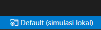
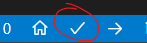

# Cara Build Firmware
1. Buka folder ini pada VSCode
2. Download extension platformio
3. Pilih project environment dibawah 
    - env:esp32dev_RTC_Clock 
    - env:esp32dev_NTP_Clock 
4. Ubah default_envs pada platformio.ini atay klik ini pada bagian bawah vscode  
4. Klik ctrl+shift+p lalu ketik platformio build atau klik  
5. Jika berhasil akan muncul file firmware.bin dan firmware.elf pada folder .pio/build/\<env\>/

# Cara Menjalankan Simulasi pada VSCODE
1. Buka folder ini pada VSCode
2. Download extension Wokwi simulator 
3. Pastikan path firmware.bin dan firmware.elf pada wokwi.toml sudah benar
4. Klik ctrl+shift+p lalu ketik wokwi start simulator
 
 
